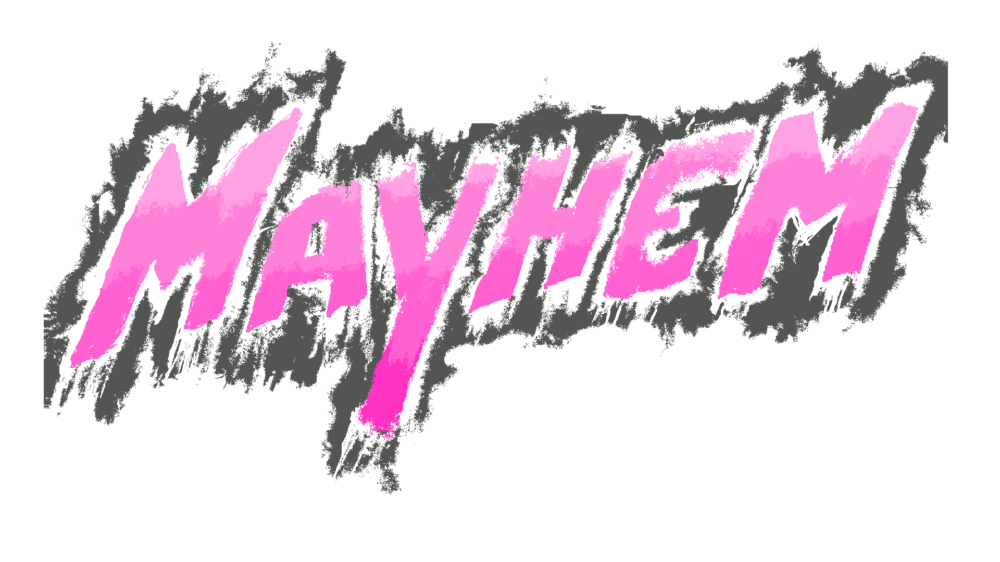
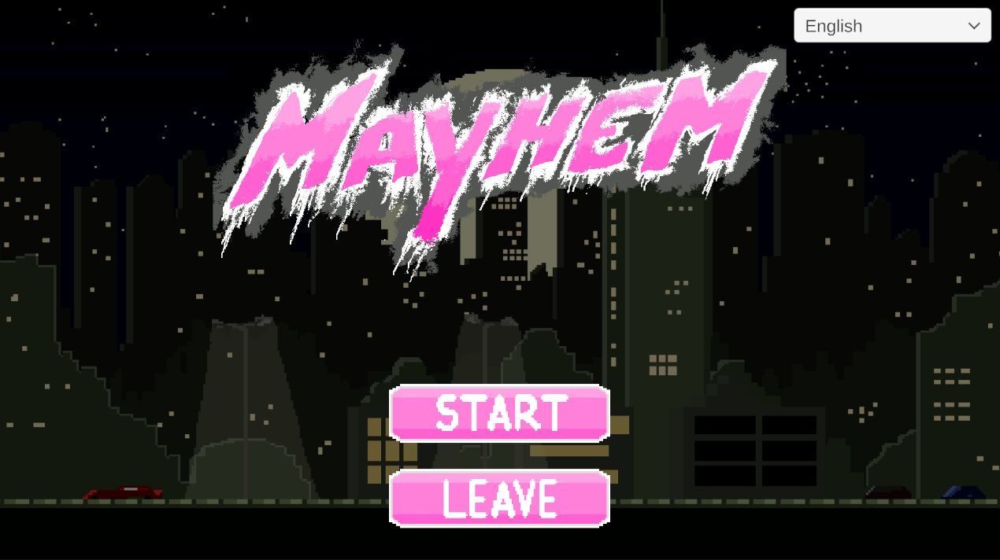
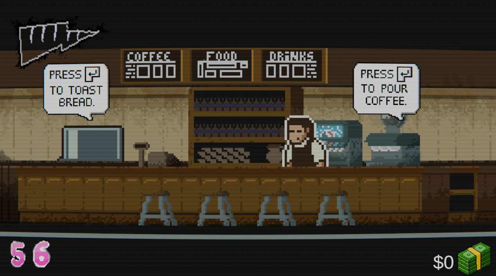
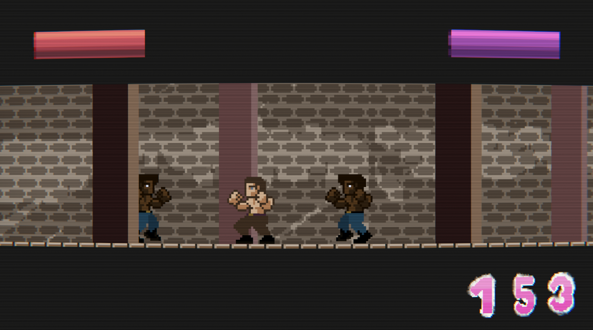
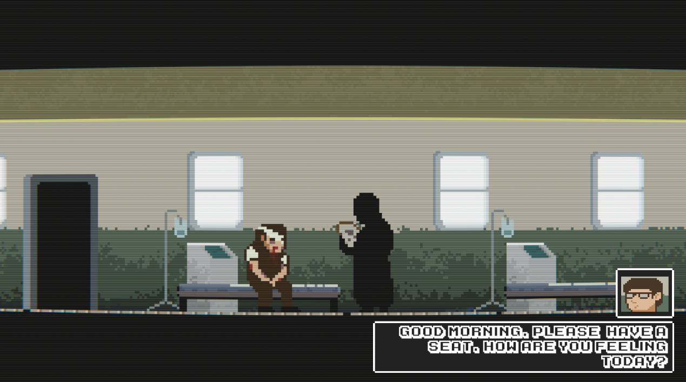

 

  

  <h3 align="center">MAYHEM</h3>

  

    A 2D pseudo platformer-fighting game made for the DJD1 class at Universidade Lusófona's Videogames Ba!
     
    <a href="https://github.com/simaocampanicodev/mayhem"><strong>Explore the docs »</strong></a>
     
  

## About The Project

“We are the All-Singing, All-dancing crap of this world”

 Taking place in the same universe of the critically acclaimed film Fight Club (1999), you play in the perspective of William Richter, a nobody who struggles to afford a place in society. 
 Working in various jobs to make it to the end of the month, he hates his jobs because of the amount of stress from customers and his boss and repetitive work he must endure, and outside work he suffers from alcohol and drug addictions, whoever he is trying his best no slowly drop those bad activities, sometimes choosing for a late night walk to clear his head to not give in to his temptations. 
 In the late night walks he discovers the bar where the Fight Club occurs, and takes a liking to it so he can dispose of all his anger and stress to people who share similar problems in their everyday lives, and as the story goes on, William gets more involved in the plans (Such as Project Mayhem) to take down society’s structure to start over. 
 

(<a href="#readme-top">back to top</a>)

## Getting Started

Here's the list of controls of the game:

- A - Move Left
- D - Move Right
- Q - Drop Toast
- E - Drop Coffee
- Enter/Mouse Button 1 - Skip Dialogue
- Enter/Circle - Interact/Pick Up/Deliver Orders
- Space/Cross - Boost
- W + Mouse Button 1/Joystick Up + Circle - Uppercut
- S + Mouse Button 1/Joystick Down + Circle - Down attack
- Mouse Button 1/Circle - Attack
- Mouse Button 2/Square - Block

(<a href="#readme-top">back to top</a>)

## Contributors

Here's the list of the contributors of our game, we highly appreciate everyone reading this and we tried our best to make a good game, every feedback is **greatly appreciated**.

If you have a suggestion that would make this better, please contact us.
Don't forget to give the project a star! Thanks again!

. Simão Campaniço - [simaocampanicodev](https://github.com/simaocampanicodev)

. João Ferreira - [KR1PT1CS](https://github.com/KR1PT1CS)

. Dinis Barroso - [DinisB](https://github.com/DinisB)

. Rafael Martins - [RafaelSMartins](https://github.com/RafaelSMartins)

. Ivan Batista - [@whos_batixta](https://www.instagram.com/whos_batixta?igsh=YXd0enZncDF6MzI0)

(<a href="#readme-top">back to top</a>)

## Contact

Github Link: <a href="https://github.com/simaocampanicodev/mayhem"><strong>https://github.com/simaocampanicodev/mayhem</strong></a>

 
Itch.io Link: <a href="https://txgerdev.itch.io/mayhem"><strong>https://txgerdev.itch.io/mayhem</strong></a>

(<a href="#readme-top">back to top</a>)

